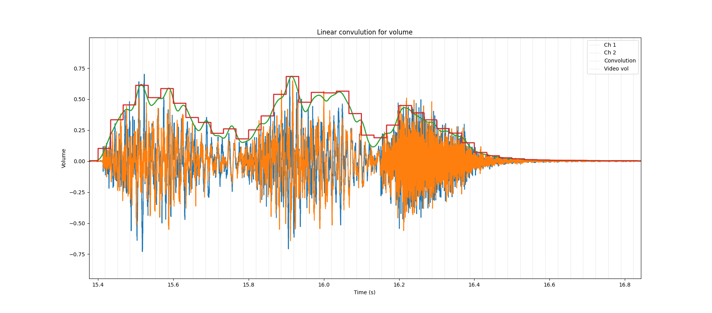
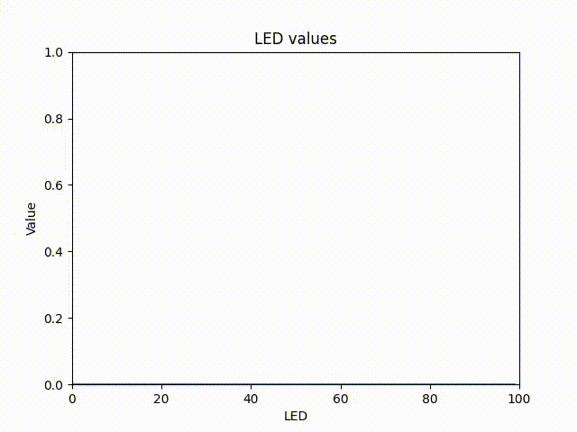

# py-led_audio_visualizer
Animate a row of individually adressable leds using a raspberry pi to react to a given song.

## Libraries
For building this proyect I used:
- Numpy: for basically everything
- Matplotlib: for visualizing the audio results
- cv2: to generate the resuliting videos
- colour: for conversions between colours
- tqdm: for making progress bars
- rpi_ws281x: to control the led strip (<a href="https://github.com/jgarff/rpi_ws281x">from this repo</a>)

## Volume animations
Volume animations are made based on the volume of the signal in the .wav file. 
The signal is averaged using a hamming window, as show in: 
</img>
Where the blue and orange lines are the channels of the song 
The green line is the result of the average  
The red line is the result of discretacing the green line for a 30 fps video 
One of the animations that can be created using this is the following
</img>

## FFT animations
This animations are based on the fft of the singal. 
This animations depend on more values such as:
- The size of the fft window
- The maximum frequency
- Some interpolation parameters 
You can see the value of the leds based on these fft in here:
</img> 
One of the animations that can be created using this is the following
</img>

